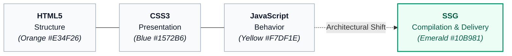
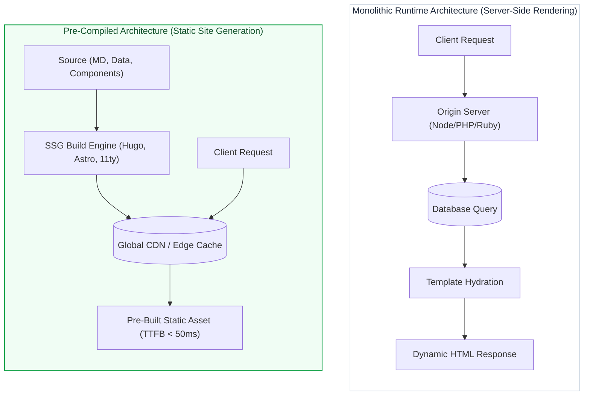
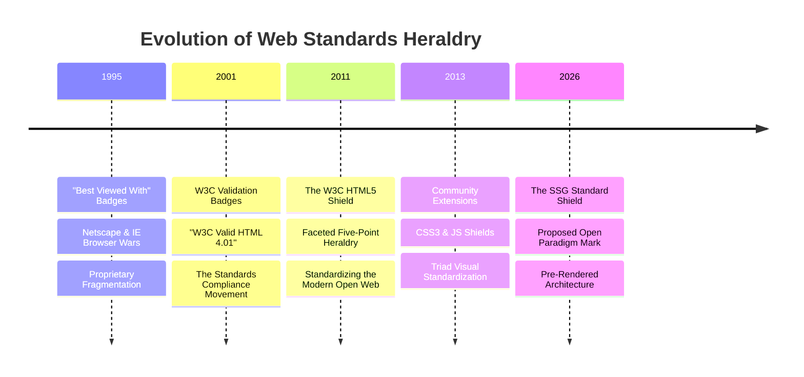
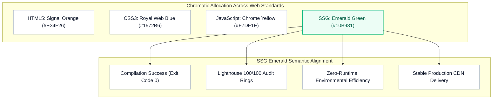
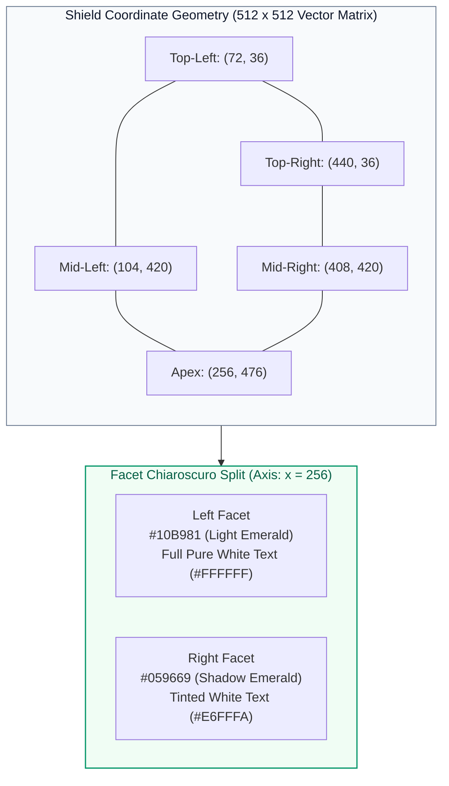
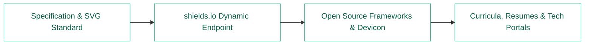

For more than three decades, the visual taxonomy of the World Wide Web has evolved alongside its underlying architectural models. When developers communicate technical competencies, stack topologies, or system designs, they do not rely solely on prose; they rely on an established visual shorthand.

We immediately recognize the orange shield of HTML5, the blue shield of CSS3, and the yellow badge of JavaScript. Together, they form the canonical trinity of client-side web development:



Despite the industry-wide transition toward pre-rendered, decoupled, and edge-distributed architectures, the discipline of Static Site Generation (SSG) has remained visually fragmented. It is represented either by proprietary vendor marks (Hugo, Astro, Jekyll, 11ty, Gatsby), file format specifications (Markdown’s M↓), or commercialized industry movements (Netlify’s Jamstack).

Static Site Generation is not merely a toolchain; it is an architectural layer. It demands a formal, vendor-neutral standard mark designed according to the World Wide Web Consortium (W3C) design grammar.

## 1. The Architectural Shift: Why SSG Is a Distinct Tier

In traditional dynamic web architectures, page rendering is synchronous with client requests. A browser requests a resource, a backend runtime (PHP, Node.js, Ruby, Python) boots up, queries an SQL or NoSQL database, populates a template in memory, and transmits the resulting HTML string over HTTP.



Static Site Generation shifts the execution cost from request-time to build-time:

- Deterministic State Compilation: Source content (Markdown, AsciiDoc, headless CMS payloads), layout templates, and styling assets compile ahead-of-time (AOT) into deterministic flat files.
- Attack Surface Deprecation: By removing persistent execution engines and database listeners from the public boundary, vulnerabilities such as SQL injection, server-side memory leaks, and remote code execution are structurally eliminated.
- Decoupled Edge Distribution: Pre-compiled static trees require zero server compute to negotiate, allowing worldwide deployment across Content Delivery Networks (CDNs) with minimal Time to First Byte (TTFB).

Because this paradigm separates the content generation pipeline from the runtime delivery pipeline, it occupies an independent tier in modern software engineering. It is not captured by HTML (the output syntax), CSS (the presentation rules), or JS (the dynamic runtime client scripts). It is the compilation engine that orchestrates them all.

## 2. The Legacy of Standardized Web Emblems

The creation of open visual standards has historically defined moments of technological maturation on the web.



### Early web graphics reflected vendor fragmentation

Webmasters embedded raster badges reading “Best Viewed with Netscape Navigator” or “Optimized for Internet Explorer 4.0”. These badges communicated incompatibility rather than interoperability.

### The W3C Validation Rectangles

With the rise of the Web Standards Project (WaSP) and strict XHTML/CSS specifications, the W3C introduced rectangular badges declaring “W3C Valid XHTML 1.0” and “W3C Valid CSS”. These acted as functional certificates of compliance, yet they remained utilitarian, text-heavy, and unsuited for modern UI systems.

### The 2011 W3C HTML5 Shield

In early 2011, the W3C introduced the official HTML5 identity designed by Oyl Design. It rejected complex raster motifs in favor of a heraldic, faceted polygonal shield. The emblem became a visual anchor across the industry because it:

- Used an unmistakable, heavy polygonal silhouette that scaled cleanly from billboards to 16px favicons.
- Introduced a vertical two-tone lighting scheme (chiaroscuro) that simulated three-dimensional plane depth without gradients.
- Established an open-source visual vocabulary that the developer community quickly adopted to build the corresponding blue CSS3 and yellow JS shields.

The proposed SSG mark adopts this exact lineage, providing a coherent fourth entry for developer portfolios, technical documentation, architectural diagrams, and educational curricula.

## 3. Semiotics, Color Theory, and Visual Semantics

A standard badge cannot be arbitrary; it must communicate the essence of the technology through geometry, color, and typographic form.



### Color Theory: Why Emerald Green (#10B981 / #059669)

In interface and identity design, color assigns taxonomic categories.

Primary web spectrum spaces are already occupied:

- Signal Orange (#E34F26): Occupied by HTML. Represents structure and foundational markup.
- Web Blue (#1572B6): Occupied by CSS. Represents visual styling, layout, and cascades.
- Chrome Yellow (#F7DF1E): Occupied by JavaScript. Represents client scripting and interactivity.
- Deep Purple (#7C3AED / #777BB4): Historically claimed by PHP and server-side runtimes.

Emerald Green provides exact visual equilibrium:

- Triadic & Quadratic Harmony: On a 12-spoke subtractive/additive color wheel, emerald green is equidistant between Web Blue and Chrome Yellow, while contrasting directly with HTML Orange.
- Terminal and Build Semantics: In developer tooling, green is the universal status indicator:
  - It denotes an exit code 0 (Build succeeded in 342ms).
  - It represents the perfect score ring (100/100) on Google Lighthouse audits for performance, SEO, and accessibility.
  - It evokes the green padlock of pre-rendered, serverless security models and the energy-efficient profile of flat static file hosting.

## 4. Geometric Construction and Vector Anatomy

The proposed SSG shield is constructed on a 512×512 unit coordinate matrix, adhering strictly to the proportion rules established by the W3C badge architecture.



### The Faceted Chiaroscuro Shield

Rather than using artificial drop shadows or non-scalable raster gradients, the shield creates volume through planar division:

- The Outer Shell (#047857): Runs from (72, 36) to (440, 36), down to (408, 420), reaching the bottom apex at (256, 476) and returning via (104, 420). This provides a stable structural border that prevents visual bleed on light or dark backgrounds.
- The Left Facet (#10B981): Represents the light plane. Its boundary extends from the center vertex (256, 66) to the outer edge (102, 66), drops to (128, 392), and returns to the bottom inner seam (256, 438).
- The Right Facet (#059669): Represents the shaded plane, mirroring the left facet coordinates across the x = 256 axis.
- The Beveled Top Shelf (#34D399 at 20% opacity): Adds an architectural highlight strip running across the upper shelf (102, 66) to (410, 66), reinforcing physical plate thickness.

### Typographic Monogram vs. Symbolic Iconography

A central challenge in developer branding is optical degradation at low resolutions.

Early drafts incorporating compile arrows (`{ } ➔ 📄`), gears, or lightning bolts were rejected because nested glyphs, thin vector paths, and fine document cuts merge into an illegible shape at 16×16 or 24×24 pixel scales.

The monolithic “SSG” monogram resolves this:

- Glyph Weight: Drawn on a heavy 12px orthogonal vector grid, matching the line weight and kerning of the W3C numeral 5.
- The Seam Transition: The central letter S spans the midline (x = 256). The vector is split into two discrete paths: the left half is pure white (#FFFFFF), while the right half is tinted mint-white (#E6FFFA). This preserves the illumination illusion across the letterforms.
- Terminal Balance: The first S sits on the light facet, while the closing G anchors the shadow facet. This deliberate weight distribution ensures the badge maintains visual balance without listing to one side.

## 5. Production Specification: Scalable Vector Asset

Below is the standalone, dependency-free SVG asset. It incorporates semantic accessibility tags, relative viewboxing, and hard-coded hex values for universal rendering across build tools, static engines, and vector editors.

```svg
<svg xmlns="http://www.w3.org/2000/svg" viewBox="0 0 512 512" width="100%" height="100%">
  <defs>
    <style>
      .shield-bg { fill: #047857; }
      .shield-left { fill: #10B981; }
      .shield-right { fill: #059669; }
      .facet-highlight { fill: #34D399; opacity: 0.2; }
      .text-left { fill: #FFFFFF; }
      .text-right { fill: #E6FFFA; }
    </style>
  </defs>

  <polygon class="shield-bg" points="72,36 440,36 408,420 256,476 104,420" />
  <polygon class="shield-left" points="256,66 102,66 128,392 256,438" />
  <polygon class="shield-right" points="256,66 410,66 384,392 256,438" />
  <polygon class="facet-highlight" points="102,66 410,66 394,106 118,106" />

  <g class="text-left">
    <path d="M 124 180 L 206 180 L 206 216 L 158 216 L 158 238 L 206 250 L 206 312 L 124 312 L 124 276 L 172 276 L 172 260 L 124 248 Z" />
    <path d="M 218 180 L 256 180 L 256 248 L 218 238 L 218 216 L 256 216 L 256 180 Z" />
    <path d="M 218 312 L 218 276 L 256 276 L 256 312 Z" />
  </g>

  <g class="text-right">
    <path d="M 256 180 L 298 180 L 298 216 L 256 216 Z" />
    <path d="M 256 248 L 298 258 L 298 312 L 256 312 Z" />
    <path d="M 256 260 L 264 260 L 264 276 L 256 276 Z" />
    <path d="M 310 180 L 392 180 L 392 216 L 344 216 L 344 276 L 368 276 L 368 254 L 392 254 L 392 312 L 310 312 Z" />
  </g>
</svg>
```

## 6. Implementation and Standardization Roadmap

For a technology badge to gain acceptance, it must follow an open-source integration pipeline across developer ecosystems:



- Ecosystem Packaging: Integrate the SVG definition into community icon registries, including Devicon, Simple Icons, and Font Awesome, under the category Architecture / Compilers / SSG.
- Badge Provider Integration: Deploy the base coordinate specification to badge-generation engines like Shields.io, enabling repository maintainers to display build-time classifications.
- Academic & Industry Taxonomies: Provide educators and curriculum directors at universities and technical academies with an umbrella visual asset to group tools like Hugo, Astro, 11ty, Jekyll, VitePress, and Quarto under a unified discipline, distinguishing Edge-Compiled Architecture from Client-Side Frameworks and Dynamic Monoliths.

Standardizing an SSG shield provides the web platform with a cohesive visual identity. Placing this emerald shield alongside the orange of HTML, the blue of CSS, and the yellow of JavaScript closes an architectural loop, giving modern pre-rendered web systems the visual standard they deserve.
