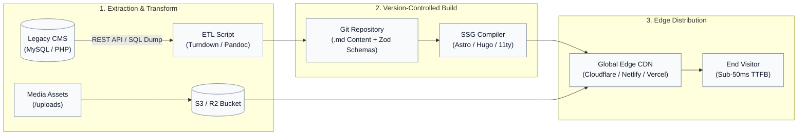

Migrating an organization from a database-driven Content Management System (CMS), such as WordPress, Drupal, or a custom PHP and SQL stack, to a Static Site Generator (SSG) fundamentally alters the operational model of a website.

The transition eliminates runtime server execution, replacing dynamic database queries with deterministic ahead-of-time (AOT) compilation distributed globally over Content Delivery Network (CDN) edge caches.

## Architectural Transition Overview

The core shift decouples content authoring and build-time compilation from the public delivery layer:



## Phase 1: Content Audit, URL Inventory, and Schema Definition

Before extracting data, document the existing footprint so that no pages, assets, or search index signals are lost.

### Crawl and Extract All Production Routes

Run a headless crawler, such as Screaming Frog, `wget --spider`, or a custom Node.js script, to generate a complete URL manifest containing:

- Target canonical paths and legacy query strings such as `?p=123`.
- Meta titles, OpenGraph images, and SEO descriptions.
- Categorical taxonomies, tag archives, and paginated routes such as `/page/2/`.

### Isolate Dynamic Dependencies

Identify every plugin-based runtime feature that requires a serverless or client-side equivalent, including search, contact forms, gated authentication, and user comments.

### Define Flat-File Schema Contracts

Create strict schema validation for front matter using tools such as Zod, which is standard in Astro Content Collections, to prevent malformed data from breaking production builds:

```typescript
// src/content/config.ts
import { defineCollection, z } from 'astro:content';

const blog = defineCollection({
  type: 'content',
  schema: z.object({
    title: z.string(),
    description: z.string(),
    pubDate: z.coerce.date(),
    updatedDate: z.coerce.date().optional(),
    author: z.string().default('Editorial Staff'),
    tags: z.array(z.string()).default([]),
    featuredImage: z.string().url().optional(),
    draft: z.boolean().default(false),
  }),
});

export const collections = { blog };
```

## Phase 2: Content Extraction and Transformation (ETL)

Extracting structured data from an SQL database into clean Markdown files requires normalizing legacy HTML, stripping non-standard shortcodes, and mapping relational metadata into YAML front matter.

### The Extraction Script

A script can query the CMS REST API or an exported local database dump, convert HTML bodies into Markdown with Turndown, and write formatted files:

```javascript
// scripts/extract-content.mjs
import fs from 'node:fs/promises';
import path from 'node:path';
import TurndownService from 'turndown';
import matter from 'gray-matter';

const turndown = new TurndownService({
  headingStyle: 'atx',
  codeBlockStyle: 'fenced'
});

async function extractWordPressContent() {
  const endpoint = 'https://legacy-site.example/wp-json/wp/v2/posts?per_page=100';
  const response = await fetch(endpoint);
  const posts = await response.json();

  for (const post of posts) {
    // Strip CMS-specific shortcodes and sanitize HTML
    const cleanedHtml = post.content.rendered.replace(/\[\/?et_pb_.*?\]/g, '');
    const markdownBody = turndown.turndown(cleanedHtml);

    const frontmatter = {
      title: post.title.rendered,
      slug: post.slug,
      pubDate: new Date(post.date).toISOString().split('T')[0],
      author: 'Editorial Team',
      tags: post.tags_names || [],
      legacyId: post.id
    };

    const fileContent = matter.stringify(markdownBody, frontmatter);
    const outputPath = path.join(process.cwd(), 'src/content/blog', `${post.slug}.md`);
    await fs.writeFile(outputPath, fileContent, 'utf-8');
  }
}

extractWordPressContent();
```

## Phase 3: Media Offloading and Path Rewriting

Storing gigabytes of images directly in a Git repository bloats clone times and degrades build performance.

### Mirror Uploads to Object Storage

Sync `/wp-content/uploads/` directly to an S3-compatible bucket, such as Cloudflare R2 or AWS S3, mapped to a dedicated asset subdomain such as `https://assets.example.com`.

### Rewrite References

Run a search-and-replace across the generated Markdown corpus, replacing local origin paths with the CDN-backed asset URL.

### Apply Local Responsive Optimization

Reserve the SSG's native image optimization pipeline, such as `<Image />` in Astro or VitePress, for core UI elements, logos, and hero graphics. This allows the build system to output modern AVIF and WebP formats automatically.

## Phase 4: Dynamic Feature Decoupling

Dynamic server-side capabilities are replaced with client-side or edge-computed primitives:

| Dynamic CMS feature | Static or decoupled replacement | Technical implementation |
|---|---|---|
| Site search | Pagefind / Algolia | Pagefind indexes compiled static HTML at build time, executing fast browser searches without a running server. |
| Contact forms | Cloudflare Workers / Resend | A pure HTML `<form>` submits to a serverless edge endpoint that validates payloads and delivers messages through an API. |
| User comments | Giscus / Cusdis | Lightweight, privacy-focused comment widgets backed by GitHub Discussions or lightweight API stores. |
| Authentication | Supabase Auth / Clerk | A client-side SDK or edge middleware verifies session tokens before rendering gated static views. |
| E-commerce | Stripe Checkout / Shopify | Hosted, PCI-compliant payment links or embedded widgets replace monolithic cart engines. |

## Phase 5: SEO Preservation and Redirect Mapping

Maintaining search visibility depends on preserving URL continuity or issuing strict HTTP 301 redirects for structural modifications.

### Retain Canonical Permalinks

Where possible, align the SSG directory structure with historical URL patterns such as `/blog/[year]/[slug]/`.

### Build an Atomic Redirect Manifest

Generate a root redirect configuration, such as `_redirects` for Cloudflare Pages or Netlify, or `vercel.json` for Vercel, to handle legacy queries and modified paths:

```text
# _redirects
/category/updates/*   /tags/updates/         301!
/feed/                /rss.xml               301!
/?p=:id              /posts/legacy-:id/     301
/wp-content/uploads/* https://assets.example.com/:splat 301
```

### Validate the Crawl

Run automated link-checking tools against the local static build to verify that internal references, canonical tags, and OpenGraph parameters resolve to valid `200 OK` responses.

## Phase 6: Deployment and Cutover Execution

The deployment process follows a low-risk, verified release pipeline.

### Automate Continuous Integration

Configure a GitHub Action to validate front matter schemas, run the static build, and compile the search index on every merge to `main`.

### Reduce DNS TTL

Lower the DNS A or CNAME Time-To-Live (TTL) on the production domain to 300 seconds, or five minutes, at least 48 hours before launch.

### Run a Delta Sync and Editorial Freeze

Place the legacy CMS into an editorial read-only state. Re-run the ETL script to capture final post edits, comments, and published assets.

### Perform the DNS Switchover

Update DNS records to route traffic to the edge hosting platform. Because the site consists of pre-compiled files, deployment is fast and resistant to traffic-spike failures.

### Complete Post-Launch Verification

Submit the generated `sitemap-index.xml` directly to Google Search Console and monitor edge analytics for unexpected 404 spikes. Confirm that the primary routes, redirects, media assets, forms, search, and metadata all behave as expected before returning the organization to normal publishing operations.
