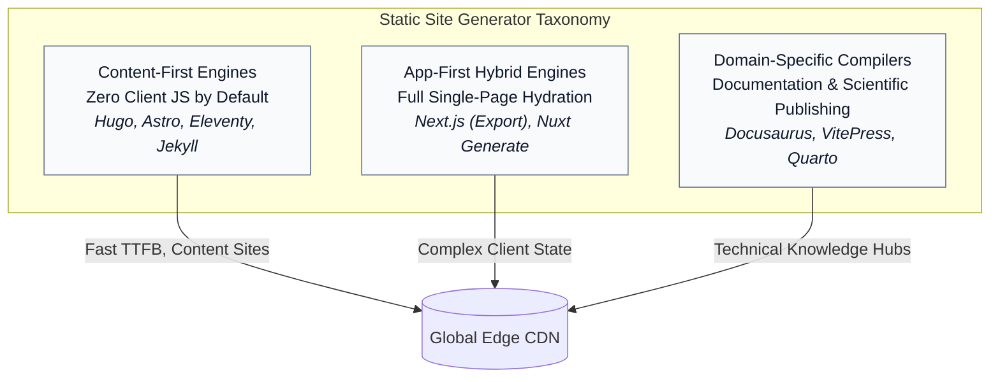
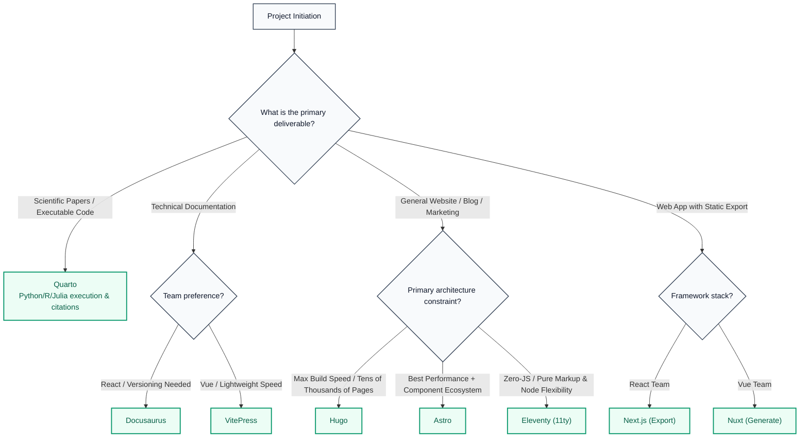

Static site generators (SSGs) have evolved from simple Markdown compilers into specialized build engines powering marketing platforms, software documentation, and high-performance content networks. While all SSGs share the core philosophy of shifting rendering costs from request-time to build-time, their underlying architectures, developer ergonomics, and runtime footprints vary considerably.

The modern landscape includes Hugo, Astro, Eleventy, Docusaurus, VitePress, Quarto, Jekyll, Next.js, and Nuxt. Each occupies a different place on the spectrum between zero-JavaScript content publishing and fully hydrated application experiences.

## The SSG Architectural Spectrum

Modern static generators cluster into distinct architectural tiers based on runtime dependencies, hydration models, and primary use cases:

## Detailed Analysis of Key Static Site Generators

### 1. Astro

A modern web framework designed for content-rich websites, built around the Islands Architecture (`astro-islands`). It defaults to zero client-side JavaScript while allowing isolated interactive components written in React, Vue, Svelte, or Solid to hydrate on demand.

**Pros**

- **Zero JS baseline:** Compiles to pure HTML and CSS unless client scripts are explicitly shipped with `client:*` directives.
- **UI-agnostic component mesh:** Teams can use React components alongside Vue or Svelte widgets within the same template.
- **Strict content collections:** Built-in front matter validation powered by Zod prevents broken schemas and missing metadata at build time.

**Cons**

- **Not a single-page app by default:** Complex, persistent global state transitions, such as an audio player that persists across full-page navigation, require manual setup through View Transitions.
- **Build scaling on huge sites:** While fast, its Node.js/Vite build pipeline does not match Hugo's raw binary execution speed on repositories exceeding 30,000 pages.

**Best used for:** Marketing homepages, company blogs, agency portfolios, and modern hybrid publishing platforms.

### 2. Hugo

Written in Go, Hugo is an established pioneer in build performance. It ships as a single compiled binary without requiring Node.js, Ruby, or Python dependencies.

**Pros**

- **Unrivaled compilation speed:** Compiles thousands of Markdown pages in fractions of a second, typically at sub-millisecond per page speeds.
- **Zero dependency hell:** A single executable means no `node_modules` directory, making CI/CD pipelines fast and less exposed to npm supply-chain failures.
- **Deep native taxonomy system:** Built-in handling of categories, tags, sitemaps, RSS feeds, and multilingual localization without plugins.

**Cons**

- **Go templating syntax:** The Go `html/template` language has a steep learning curve and lacks the familiarity of JSX or standard template literals.
- **Asset pipeline quirks:** Managing complex modern CSS and JavaScript bundles through Hugo Pipes requires Hugo-specific conventions rather than standard Vite or Webpack ecosystems.

**Best used for:** Massive blogs, media archives, high-volume news catalogs, and organizations prioritizing build speed and minimal maintenance.

### 3. Eleventy (11ty)

Eleventy is a lightweight Node.js-based generator created by Zach Leatherman as a JavaScript-native response to Jekyll. It does not enforce an opinionated client runtime.

**Pros**

- **No client runtime overhead:** Outputs raw, performant HTML by default.
- **Polyglot templating:** Supports Markdown, Liquid, Nunjucks, WebC, JavaScript, Mustache, and HTML within the same project.
- **Progressive decoupling:** Does not assume a frontend framework; authors control every byte of CSS and JavaScript shipped to the browser.

**Cons**

- **No built-in interactive component model:** An island model is not available out of the box unless paired with WebC or custom tooling.
- **Configuration fatigue:** Its unopinionated design means image optimization, asset pipelines, and client-side bundlers require manual wiring.

**Best used for:** Minimalist web craft, personal developer blogs, accessible corporate homepages, and teams wanting complete control over emitted markup.

### 4. Next.js (Static HTML Export)

Next.js is the dominant enterprise React framework. When configured with `output: 'export'`, it pre-renders every page route into pure HTML, CSS, and client-side React bundles.

**Pros**

- **React ecosystem dominance:** Leverages the large npm ecosystem of React components, design systems, and charting libraries.
- **Unified developer stack:** Teams already building applications in Next.js do not need to switch to a new templating language.
- **Seamless path to dynamic:** Transitioning a static site to hybrid serverless functions using SSR or ISR requires configuration changes rather than a full rewrite.

**Cons**

- **Heavy client-side bundle:** Every page ships the React runtime and hydration bundle, degrading initial JavaScript execution metrics and Core Web Vitals on low-powered mobile devices.
- **Overkill for content sites:** A full React hydration layer simply to render long-form text introduces unnecessary complexity.

**Best used for:** Web applications that are primarily interactive client-side portals, gated software interfaces, or sites built by React-heavy product teams.

### 5. Nuxt (`nuxt generate`)

Nuxt is the premier full-stack framework for the Vue.js ecosystem. The `npx nuxt generate` command crawls application routes and emits a static artifact ready for CDN hosting.

**Pros**

- **Intuitive Vue developer experience:** File-based routing, automated imports, and Vue 3 Composition API ergonomics.
- **Nuxt Content module:** Provides an integrated headless CMS experience capable of querying local Markdown files with MongoDB-like filtering syntax.
- **SEO-ready defaults:** Automatic meta tag management and sitemap generation are available through official modules.

**Cons**

- **Mandatory Vue hydration:** Similar to Next.js, static exports still deliver the Vue runtime bundle to the client browser.
- **Ecosystem shift:** Differences between Nitro server routes and static pre-rendering require care during deployment configuration.

**Best used for:** Vue developers building marketing sites, interactive product showcases, and content sites powered by the `@nuxt/content` engine.

### 6. Jekyll

Jekyll originally popularized the modern static site architecture. Built in Ruby and integrated into GitHub Pages, it remains widely deployed across open-source project repositories.

**Pros**

- **Native GitHub Pages integration:** Pushing a commit to a GitHub repository automatically builds and deploys Jekyll without custom CI/CD setup.
- **Simple Liquid syntax:** Layouts, includes, and loops are easy for beginners to understand.
- **Vast theme library:** Thousands of pre-existing themes and battle-tested blogging plugins are available.

**Cons**

- **Ruby environment setup:** Managing Ruby gems, Bundler, and native C extensions on modern workstations, especially macOS and Windows, can be brittle.
- **Slow build times:** Large content repositories become noticeably slower past several hundred pages.

**Best used for:** Quick project sites hosted directly on standard GitHub Pages and developers maintaining legacy Ruby sites.

### 7. Docusaurus

Maintained by Meta, Docusaurus is an opinionated static documentation engine built on React for software projects, APIs, and developer wikis.

**Pros**

- **Turnkey documentation features:** Page versioning, nested hierarchy sidebars, Algolia DocSearch integration, and localized routing are available out of the box.
- **MDX integration:** Interactive React components, live code editors, and dynamic playground widgets can be embedded directly inside Markdown documentation files.
- **Active enterprise maintenance:** It is backed by Meta and used widely across major open-source projects such as React Native, Jest, and Babel.

**Cons**

- **Rigid structural paradigm:** Building an unconventional layout outside a documentation or blog architecture can mean working against the framework's defaults.
- **React SPA overhead:** The framework operates as a single-page app and loads the full React bundle on the initial page visit.

**Best used for:** Developer documentation portals, API references, open-source library guides, and technical product manuals.

### 8. VitePress

VitePress is a modern documentation engine built on Vite and Vue 3, created by Evan You as the successor to VuePress.

**Pros**

- **Extreme developer velocity:** Vite provides instant Hot Module Replacement during authoring.
- **Minimal footprint:** It is considerably lighter and faster than Docusaurus, emitting lean HTML alongside selective Vue hydration.
- **Polished defaults:** The default theme provides a responsive technical documentation layout with dark mode, search, and navigation.

**Cons**

- **Documentation-centric:** Like Docusaurus, it is purpose-built for technical manuals and is not suitable for general-purpose e-commerce or complex web apps.
- **Smaller plugin ecosystem:** It has fewer specialized add-ons than the extensive React and Docusaurus communities.

**Best used for:** Software library documentation, component system guides, internal engineering handbooks, and Vue-aligned projects.

### 9. Quarto

Quarto is a multi-language scientific and technical publishing system built on top of Pandoc by Posit, formerly RStudio.

**Pros**

- **Executable computation:** It directly executes Python, R, Julia, and Observable code chunks inside `.qmd` files, generating charts, tables, and model outputs into static pages.
- **Single-source multi-format publishing:** The same source repository can compile into a static website, a high-resolution academic PDF through LaTeX, an ePub book, or interactive HTML slides through Reveal.js.
- **Academic rigor:** Built-in citations, BibTeX bibliography rendering, cross-referencing, and LaTeX math notation support formal publishing workflows.

**Cons**

- **Non-standard web stack:** Developers accustomed to npm and Vite may find its CLI and Pandoc-based pipeline unfamiliar.
- **Heavy installation:** Full functionality may require Pandoc, Python or R runtimes, and TeX distributions.

**Best used for:** Academic research labs, data science reporting, computational textbooks, scientific journals, and lecture materials.

## Technical Comparison Matrix

| Generator | Language engine | Default client JS | Build performance | Templating / component model | Primary target |
|---|---|---|---|---|---|
| Astro | Node / Vite | Zero, opt-in | Fast | Multi-framework (`.astro`, React, Vue) | Modern web and content sites |
| Hugo | Go binary | Zero | Fastest, sub-second | Go HTML templates | Large-scale media and blogs |
| Eleventy | Node.js | Zero | Fast | Polyglot (Liquid, Nunjucks, WebC) | Minimalist sites and performance |
| Next.js | React / Node | Full hydration | Moderate | React (JSX / TSX) | Hybrid apps and React platforms |
| Nuxt | Vue / Vite | Full hydration | Moderate | Vue 3 single-file components | Vue applications and portals |
| Jekyll | Ruby | Zero | Slow | Liquid | GitHub Pages and legacy blogs |
| Docusaurus | React / Node | Full hydration | Moderate | Markdown / MDX / React | Versioned software documentation |
| VitePress | Vue / Vite | Selective | Very fast | Markdown / Vue components | Modern technical documentation |
| Quarto | Pandoc / CLI | Zero to minimal | Variable, with code execution | Computational Markdown (`.qmd`) | Academic and data science publishing |

## The Selection Logic: What to Use and When

Choosing the correct static site generator requires aligning a project's content requirements, performance constraints, and team skills with the right engine:

## The Concrete Decision Guidelines

- **Default to Astro** for a new marketing website, blog, or agency project. Its Islands Architecture delivers strong Core Web Vitals out of the box, supports components from multiple UI frameworks, and maintains schema integrity through built-in Content Collections.
- **Choose Hugo** when building massive publications with more than 20,000 pages, when build times are critical, or when a single binary is preferred over an extensive dependency tree.
- **Choose VitePress or Docusaurus** for software documentation. Use VitePress for lightweight speed; use Docusaurus when complex versioning, localization, and React MDX integration are required.
- **Choose Quarto** when documents contain executable mathematics, machine learning models, statistical code, or formal academic citations that must be published across web and PDF formats.
- **Choose Next.js or Nuxt** only when the static site is a staging ground for a larger application that genuinely requires client-side routing, shared state, or a future migration to full-stack serverless rendering. Avoid them for content-only blogs, where shipping an entire framework runtime simply to display text introduces unnecessary complexity and latency.
