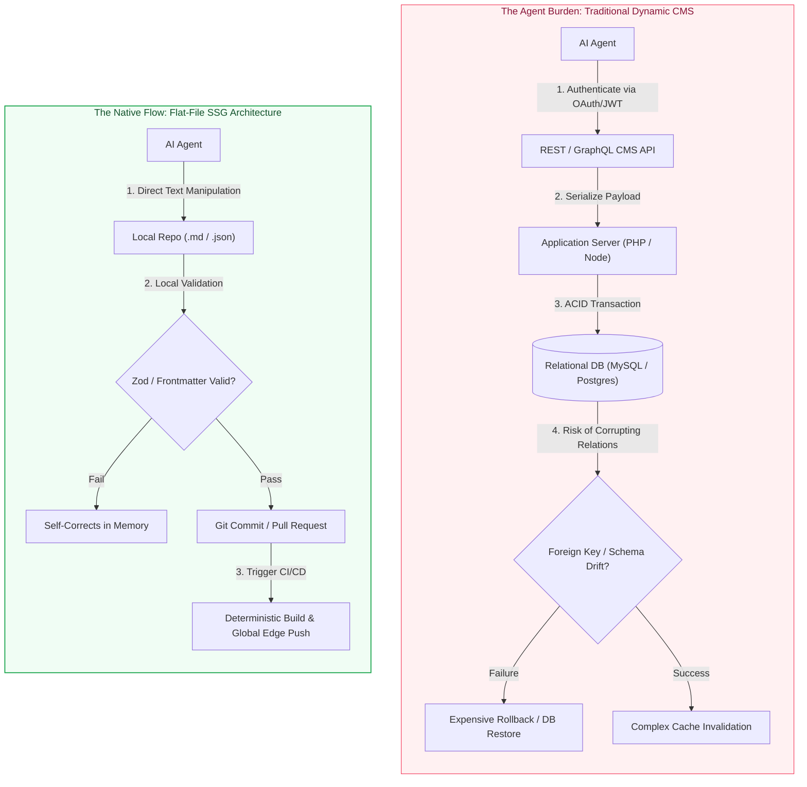
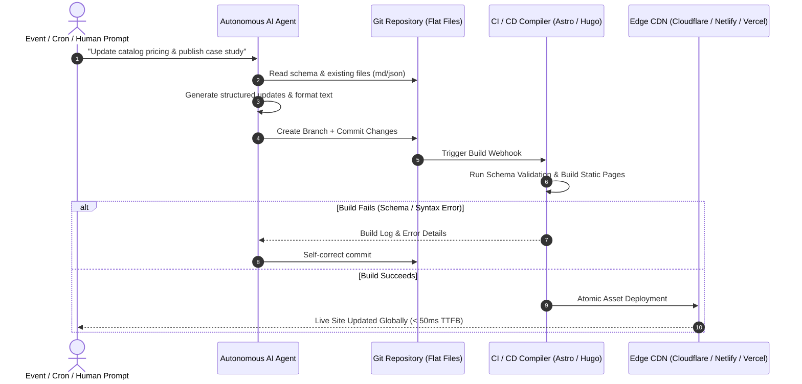
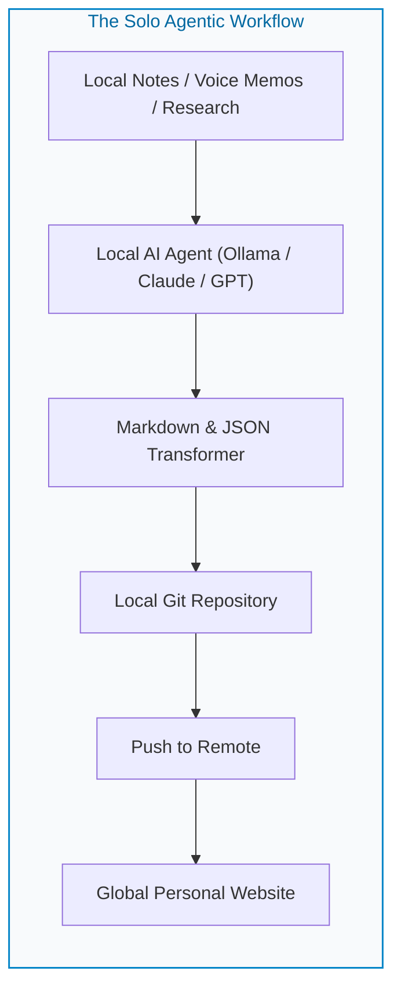
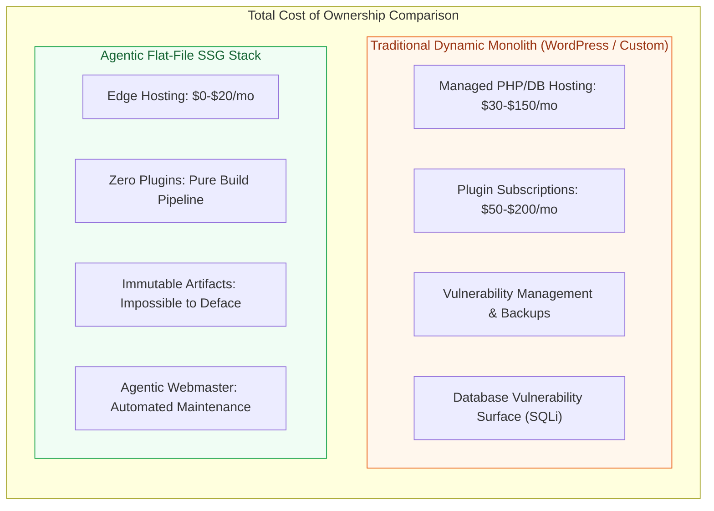

For nearly two decades, the architecture of the web was dominated by a singular assumption: a website is an interface on top of a dynamic SQL database. Systems like WordPress, Drupal, and custom monolithic applications took root because non-technical users needed a graphical user interface (GUI) to modify database rows, which a server runtime would reassemble into HTML on every incoming HTTP request.

The explosion of Autonomous AI Agents has upended that paradigm.

When an AI agent - whether an autonomous background worker, a local coding assistant, or an enterprise orchestrator - interacts with software, it does not need a web-based WYSIWYG editor or a relational database engine. Agents think in text, schemas, and trees.

By pairing Static Site Generators (SSGs) with simple flat-file databases - collections of structured Markdown (`.md`) files and normalized JSON datasets - we unlock a web architecture that is faster, more secure, and radically easier for AI agents to maintain than traditional content management systems.

## 1. The Friction of Traditional CMS in an AI-First World

Asking an AI agent to maintain a traditional database-backed CMS involves unnecessary cognitive overhead and operational fragility:



### The Tool-Calling Tax

To update a product catalog or publish an article in a monolithic CMS, an agent must:

- Negotiate authentication handshakes and format API tokens.
- Format payloads against vendor-specific endpoint schemas.
- Traverse database normalization constraints, including foreign keys, join tables, and media library IDs.
- Navigate opaque database error states that offer poor context for automated recovery.

### The Auditing and Rollback Problem

When an autonomous model writes directly to an SQL database, rollbacks are complex. If an agent hallucinates, overwrites a field, or corrupts relational integrity, recovering requires point-in-time database restores.

In contrast, flat files governed by Git provide a built-in audit log. Every synthetic edit is a clean atomic commit or pull request that can be inspected, diffed, linted, and rolled back with zero data loss.

## 2. Flat Files: The Native Lingua Franca of LLMs

Large Language Models do not natively think in binary database pages or tabular B-trees; their training datasets consist of structured text. Markdown and JSON represent the natural data structures of generative AI.

### Markdown for Unstructured Prose (Content Layer)

Markdown provides maximum semantic density with minimal token consumption. By pairing plain Markdown with YAML or TOML front matter, we give agents a rigid schema for metadata alongside flexible space for natural language:

```markdown
---
title: "Distributed Edge Computing for Regional Logistics"
slug: "distributed-edge-logistics"
date: "2026-09-22"
author: "Autonomous Research Agent"
tags: ["Edge", "Architecture", "Logistics"]
status: "published"
summary: "An architectural review of sub-50ms edge processing nodes."
---

Modern logistics hubs require real-time routing optimization without
relying on round-trip latency to centralized cloud regions...
```

An agent reading this file needs no external API documentation. The keys are immediately apparent, the content is plain text, and parsing consumes minimal token context.

### JSON for Structured Datasets (Data Layer)

For structured business entities - such as inventories, pricing tables, office locations, and opening hours - a series of flat JSON or YAML files serves as a transparent database:

```json
[
  {
    "id": "srv-01",
    "name": "Cloud Architecture Audit",
    "tier": "Enterprise",
    "priceUsd": 1200,
    "available": true,
    "lastUpdated": "2026-09-21"
  },
  {
    "id": "srv-02",
    "name": "Static Site Migration",
    "tier": "Professional",
    "priceUsd": 650,
    "available": true,
    "lastUpdated": "2026-09-22"
  }
]
```

Modern SSGs such as Astro, Hugo, Eleventy, and Quarto ingest these flat JSON files during build time, treating them as first-class collections. When an agent updates a price, it reads the JSON, modifies the relevant object, and commits the file. The compiler takes care of compiling the changes into the site's layout.

## 3. The Agentic Site Operations Pipeline

By treating the file system as the database and Git as the transaction log, website management becomes a deterministic continuous integration pipeline:



### Self-Correction via Compiler Feedback

Because the build step runs in a sandboxed CI environment, agents can benefit from compiler feedback loops:

1. An agent modifies an `.md` document but leaves out a mandatory front matter field, such as `date`.
2. The SSG compiler, using tools like Astro Content Collections or Zod schemas, halts with an explicit error: `Missing required field: date in content/posts/new-post.md`.
3. The agent ingests the build log, recognizes the error, appends the missing field, and pushes a patch commit.
4. No human intervention is needed, and invalid content never reaches production.

## 4. Why This Architecture Changes the Game for Single Users

For independent researchers, engineers, solo consultants, and creators, running a dynamic CMS is often a poor allocation of time and resources.



### Zero-Maintenance Infrastructure

A personal blog or portfolio hosted on Cloudflare Pages, GitHub Pages, or Netlify costs $0/month, requires no server operating system patches, and never suffers from database connection dropouts.

### The Digital Garden Maintained While You Sleep

A personal agent can ingest raw voice transcripts, meeting summaries, or research papers, extract structured notes, format them into `.md` files with correct front matter tags, and file a pull request to your personal digital garden.

### Local-First Data Ownership

Content lives on your local machine as plain text. You are never locked into a hosted platform's proprietary database export format.

## 5. Why Small-to-Medium Businesses (SMBs) Win Big

For small-to-medium businesses - such as local service providers, dental clinics, consulting agencies, and retail shops - the traditional web agency model is notoriously inefficient. Businesses often pay monthly retainers simply to have a webmaster update opening hours, edit pricing sheets, or publish promotional banners.



### The Autonomous SMB Webmaster

By deploying an agent over a business repository, non-technical owners can interact via standard messaging tools such as Slack, WhatsApp, or email:

> **Business owner to agent:** We are closing 2 hours early this Thursday for maintenance, and our lunch special is now $14.50 instead of $16.

The agent parses this intent, pulls the repository, and executes two surgical file edits:

- `data/hours.json` adjusts the Thursday closing timestamp.
- `data/menu.json` updates the price key on item `lunch-special`.

It commits the changes with the message `chore: update thursday hours and lunch special pricing`. The static engine rebuilds the site in 15 seconds, and edge caches purge automatically worldwide.

### Structural Immunity to Cyber Threats

SMBs are prime targets for automated bots exploiting unpatched CMS plugins, database vulnerabilities, and brute-force login attacks.

An SSG has no public web server, no database listeners, and no admin login panel. The entire attack surface ceases to exist at the hosting layer. The public only interacts with static HTML, CSS, and pre-compressed image assets distributed via edge nodes.

## 6. Architectural Comparison

| Dimension | Dynamic Monolith (WordPress, Drupal) | Headless CMS + Dynamic Backend | Agent-Driven SSG (Flat-File + Git) |
|---|---|---|---|
| Data store | Relational Database (MySQL, Postgres) | Cloud Database (SaaS GraphQL/REST) | Flat Markdown & JSON Files |
| Agent interface | Emulated browser clicks or legacy APIs | Multi-step REST/GraphQL queries | Direct file read/write operations |
| Auditability | Opaque database activity logs | SaaS audit dashboards | Git diffs & commit history |
| Attack surface | High (SQLi, PHP vulnerabilities, wp-admin) | Medium (API keys, SaaS auth leaks) | Near zero (immutable static files) |
| Hosting overhead | Requires active runtime servers | Requires active Node/SSR instances | Commodity edge CDN (near-zero cost) |
| Disaster recovery | Complex database rollbacks | Dependent on SaaS backup policies | Instant (`git revert` / `git checkout`) |

## 7. Hybrid Interactivity Without Server Weight

A common misconception is that static sites cannot support dynamic interactions like contact forms, booking systems, or site search. In modern web development, these requirements are easily handled without compromising the static core:

- **Static search:** Client-side search engines like Pagefind or Stork index pre-built HTML files during compilation. They yield sub-10ms search results with zero server infrastructure.
- **Forms and inquiries:** Lightweight serverless edge endpoints such as Cloudflare Workers or AWS Lambda forward form submissions directly to an email inbox, CRM, or agent processing queue.
- **Transactional dynamic elements:** Interactive widgets, such as live stock indicators or customer portals, hydrate on demand using client-side JavaScript or Islands Architecture, pioneered by frameworks like Astro, while the rest of the site remains static.

## The Path Forward

The dynamic database CMS was an effective design pattern for an era where humans required web forms to publish content.

In an era where autonomous agents can read, author, validate, and commit structured text with higher precision than human operators, the database-backed CMS introduces unnecessary latency, security exposure, and operational cost.

By reducing the web data layer to flat Markdown files, normalized JSON catalogs, and version-controlled static compilation pipelines, we provide AI agents with their ideal operational environment. The result is a web architecture that is simpler, safer, cheaper, and faster - for solo developers and growing businesses alike.
